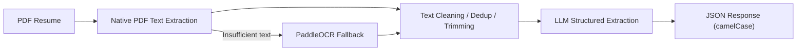

[简体中文](./README.md) | [English](./README.en.md)

# Resume-Analysis

A resume parsing service built with FastAPI, native PDF text extraction, PaddleOCR, and an LLM to convert unstructured PDF resumes into stable structured JSON.

## Overview

Resume-Analysis is designed for resume parsing. It prefers native PDF text extraction and automatically falls back to OCR when the extracted text quality is insufficient. The service outputs six fixed sections:

- Basic information
- Internship / work experience
- Project experience
- Awards
- Self-evaluation
- Others

## Features

- Supports PDF resume upload and parsing
- Uses native PDF text extraction first, with OCR fallback when needed
- Produces stable JSON output with an LLM
- Separates internship / work experience from project experience
- Extracts grouped fields such as title, organization / role, dates, and descriptions
- Returns camelCase fields for easy frontend integration
- Includes stage-level timing logs for observability
- Reuses the LLM instance, prompt template, and chain in-process

## Pipeline



## Parsing Demo

The example below is based on a real local sample, but all personal information, organization names, and detailed content have been redacted. It is included only to demonstrate the structure and output quality.

### Sample Summary

| Item | Value |
| --- | --- |
| Sample type | 1-page PDF resume |
| Extraction path | Native PDF text |
| Extracted text length | 903 characters |
| Parsed work / internship items | 2 |
| Parsed project items | 1 |
| Parsed awards | 1 |

<details>
<summary>View redacted API response example</summary>

```json
{
  "status": "success",
  "formData": {
    "basicInfo": {
      "applicantName": "Z**",
      "sex": "Hidden",
      "phone": "138****5678",
      "email": "exa***@mail.com",
      "birthday": "199*-**",
      "bornPlace": "City",
      "livingPlace": "City"
    },
    "workExps": [
      {
        "expType": "internship/work",
        "title": "Work / Internship Experience 1",
        "organization": "Organization 1",
        "startDate": "20XX-XX",
        "endDate": "20XX-XX",
        "description": "Redacted. The original output groups title, organization, time span, and description by experience item."
      },
      {
        "expType": "internship/work",
        "title": "Work / Internship Experience 2",
        "organization": "Organization 2",
        "startDate": "20XX-XX",
        "endDate": "20XX-XX",
        "description": "Redacted. The original output groups title, organization, time span, and description by experience item."
      }
    ],
    "projectExps": [
      {
        "projectName": "Project Example 1",
        "role": "Role redacted",
        "startDate": "20XX-XX",
        "endDate": "20XX-XX",
        "description": "Redacted. The original output groups project name, role, time span, and description together."
      }
    ],
    "awards": [
      {
        "awardName": "Award Example 1",
        "awardDate": "20XX-XX",
        "description": "Redacted"
      }
    ],
    "selfEvaluation": "Redacted. Preserved as a free-text self-evaluation field.",
    "others": []
  }
}
```

</details>

## Performance

The numbers below were collected on April 9, 2026 in the local `resume-analysis` conda environment using `qwen-flash` and a 1-page sample PDF. They are intended to show the current performance profile. Actual latency will vary depending on network conditions, model response time, and hardware.

| Run | Document extraction | LLM extraction | Response formatting | Total |
| --- | ---: | ---: | ---: | ---: |
| Run 1 | 3.7 ms | 9023.8 ms | 0.1 ms | 9027.6 ms |
| Run 2 | 12.4 ms | 6318.4 ms | 0.1 ms | 6330.9 ms |
| Run 3 | 14.4 ms | 5105.4 ms | 0.1 ms | 5119.9 ms |
| Warm average | 13.4 ms | 5711.9 ms | 0.1 ms | 5725.4 ms |

For this sample, the service takes the native PDF text path, so document extraction is already in the millisecond range. End-to-end latency is currently dominated by the LLM call.

## Quick Start

### Requirements

- Python 3.10+
- A valid DashScope / Tongyi credential

### Run Locally

```bash
pip install -r requirements.txt
export DASHSCOPE_API_KEY=your_api_key
python src/script.py
```

Default service address:

```text
http://127.0.0.1:8999
```

### Run with Docker

```bash
docker build -t resume-analysis .
docker run -d \
  --name resume-analysis \
  -p 8999:8999 \
  -e DASHSCOPE_API_KEY=your_api_key \
  resume-analysis
```

View logs:

```bash
docker logs -f resume-analysis
```

## API

### Endpoint

- Method: `POST`
- Path: `/analysis`
- Form field: `file`

### Example

```bash
curl -X POST "http://127.0.0.1:8999/analysis" \
  -F "file=@/path/to/resume.pdf"
```

## Configuration

The main configuration file is `config/settings.json`. Key configurable items include:

- Host and port
- CORS settings
- LLM model, prompts, and output schema
- LLM input preprocessing rules
- OCR switches, language, render scale, and angle classification
- Document extraction strategy and logging

## Project Structure

```text
.
├── config/              # Config loader, logging, and settings.json
├── src/                 # FastAPI entry and LLM extraction logic
├── utils/               # Document extraction and formatting helpers
├── Dockerfile           # Docker deployment config
├── requirements.txt     # Python runtime dependencies
└── test/                # Local sample files
```

## License

This project is licensed under the [MIT License](./LICENSE).
