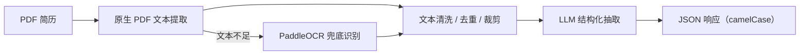

[简体中文](./README.md) | [English](./README.en.md)

# Resume-Analysis

基于 FastAPI、PDF 原生文本提取、PaddleOCR 和 LLM 的简历解析服务，用于将非结构化 PDF 简历转换为稳定的结构化 JSON。

## 项目简介

Resume-Analysis 面向简历解析场景，优先从 PDF 中提取原生文本，在文本质量不足时自动回退到 OCR，并结合大模型完成六个固定模块的结构化抽取：

- 基础信息
- 实习 / 工作经历
- 项目经历
- 获奖信息
- 自我评价
- 其他

## 功能特性

- 支持 PDF 简历上传与解析
- 原生 PDF 文本提取优先，OCR 自动兜底
- LLM 输出稳定 JSON 结构，减少后处理拼装
- 自动区分实习 / 工作经历与项目经历
- 支持成组抽取名称、组织 / 角色、时间、内容
- API 返回 camelCase 字段，便于前端直接消费
- 内置阶段耗时日志，便于定位瓶颈
- 已启用 LLM 实例、提示模板与 chain 的进程内复用

## 处理流程



## 解析效果

下面的展示基于本地真实样例运行结果整理，但所有个人信息、组织信息和具体内容均已脱敏，仅用于展示输出结构和解析效果。

### 样例概览

| 项目 | 数值 |
| --- | --- |
| 样例类型 | 1 页 PDF 简历 |
| 文本提取路径 | 原生 PDF 文本 |
| 提取文本长度 | 903 字符 |
| 输出工作 / 实习经历数 | 2 |
| 输出项目经历数 | 1 |
| 输出获奖数 | 1 |

<details>
<summary>查看脱敏后的接口响应示例</summary>

```json
{
  "status": "success",
  "formData": {
    "basicInfo": {
      "applicantName": "张**",
      "sex": "未展示",
      "phone": "138****5678",
      "email": "exa***@mail.com",
      "birthday": "199*-**",
      "bornPlace": "某城市",
      "livingPlace": "某城市"
    },
    "workExps": [
      {
        "expType": "internship/work",
        "title": "第1段实习/工作经历",
        "organization": "某机构1",
        "startDate": "20XX-XX",
        "endDate": "20XX-XX",
        "description": "已脱敏，原始输出可按经历维度成组抽取岗位、组织、时间和内容。"
      },
      {
        "expType": "internship/work",
        "title": "第2段实习/工作经历",
        "organization": "某机构2",
        "startDate": "20XX-XX",
        "endDate": "20XX-XX",
        "description": "已脱敏，原始输出可按经历维度成组抽取岗位、组织、时间和内容。"
      }
    ],
    "projectExps": [
      {
        "projectName": "项目示例1",
        "role": "项目角色已脱敏",
        "startDate": "20XX-XX",
        "endDate": "20XX-XX",
        "description": "已脱敏，原始输出可按项目维度成组抽取名称、角色、时间和内容。"
      }
    ],
    "awards": [
      {
        "awardName": "奖项示例1",
        "awardDate": "20XX-XX",
        "description": "已脱敏"
      }
    ],
    "selfEvaluation": "已脱敏，保留为自我评价文本字段。",
    "others": []
  }
}
```

</details>

## 性能结果

以下数据采集于 2026-04-09 的本地 `resume-analysis` conda 环境，使用 `qwen-flash`、1 页样例 PDF，并连续运行 3 次。结果用于展示当前项目的量级与优化效果，实际耗时会受网络、模型响应和硬件环境影响。

| 运行轮次 | 文档提取 | LLM 抽取 | 返回格式化 | 总耗时 |
| --- | ---: | ---: | ---: | ---: |
| 第 1 次 | 3.7 ms | 9023.8 ms | 0.1 ms | 9027.6 ms |
| 第 2 次 | 12.4 ms | 6318.4 ms | 0.1 ms | 6330.9 ms |
| 第 3 次 | 14.4 ms | 5105.4 ms | 0.1 ms | 5119.9 ms |
| 预热后平均 | 13.4 ms | 5711.9 ms | 0.1 ms | 5725.4 ms |

当前样例走的是原生 PDF 文本提取路径，文档提取耗时已经压到毫秒级，整体延迟主要由 LLM 调用决定。

## 快速开始

### 运行要求

- Python 3.10+
- 可用的 DashScope / 通义调用凭证

### 本地运行

```bash
pip install -r requirements.txt
export DASHSCOPE_API_KEY=your_api_key
python src/script.py
```

默认使用 `config/settings.json` 中配置的 `workers = 2` 启动。

服务默认监听：

```text
http://127.0.0.1:8999
```

### Docker 运行

```bash
docker build -t resume-analysis .
docker run -d \
  --name resume-analysis \
  -p 8999:8999 \
  -e DASHSCOPE_API_KEY=your_api_key \
  resume-analysis
```

查看日志：

```bash
docker logs -f resume-analysis
```

## API 使用

### 请求接口

- 方法：`POST`
- 路径：`/analysis`
- 表单字段：`file`

### 调用示例

```bash
curl -X POST "http://127.0.0.1:8999/analysis" \
  -F "file=@/path/to/resume.pdf"
```

## 配置说明

主要配置文件为 `config/settings.json`，当前支持的主要配置包括：

- 服务监听地址与端口
- `uvicorn` worker 数
- CORS 配置
- LLM 模型、提示词和输出 schema
- LLM 输入预处理规则
- OCR 开关、语言、渲染倍率、角度分类
- 文档提取策略与日志级别

## 项目结构

```text
.
├── config/              # 配置读取、日志和 settings.json
├── src/                 # FastAPI 入口与 LLM 抽取逻辑
├── utils/               # 文档提取、格式转换等工具模块
├── Dockerfile           # Docker 部署配置
├── requirements.txt     # Python 运行依赖
└── test/                # 本地测试样例
```

## 许可证

本项目使用 [MIT License](./LICENSE)。
